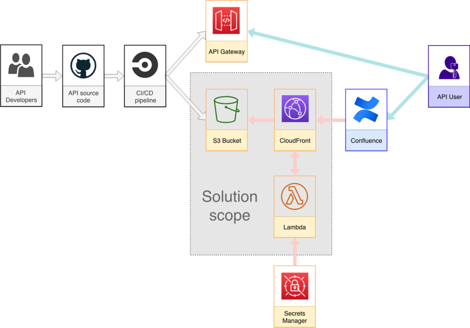

| Build status  | License |
| ------------- | ------------- |
|   |   |

## Initial conditions
Application has API defined as OpenAPI specification, in my sample it's [`petstore.yaml`](https://github.com/kagarlickij/aws-apigateway-sample/blob/master/petstore.yaml)

OpenAPI specification shouldn't be public.

Confluence has Open API (Swagger) Integration plugin installed to display OpenAPI specification in human readable way: http://prntscr.com/n3ls9d

This plugin can use only basic auth to read OpenAPI specification from remote location.

## Task
When API specification is updated in git (master branch only) it must be updated on Confluence automatically.

## Solution
When `petstore.yaml` is changed in `aws-apigateway-petstore-sample` repo CI uploads it to S3 bucket.

CloudFront with Lambda are used to add basic auth to `petstore.yaml` stored on S3.

AWS Secrets Manager is used to store password for basic auth.

CloudFormation is used to build the whole infrastructure except AWS Secrets Manager (security-related actions shouldn't be automated).

CircleCI is used to test and apply CloudFormation, however it can be easily replaced with Jenkins or other CI.

## Known issues and workarounds
### 1. Lambda speed vs AWS Secrets Manager request (error 503)
Lambda Edge used with CloudFront Viewer request can't have more than 128 Mb RAM and 5 sec of execution time:

https://docs.aws.amazon.com/AmazonCloudFront/latest/DeveloperGuide/cloudfront-limits.html

Lambda is written on NodeJS and it uses AWS SDK to get password value from AWS Secrets Manager.

Lambda has significant cold start so total execution on 128 Mb RAM could take more than 5 sec.

This is the reason why you could see 503 error in response when request file via CloudFront: http://prntscr.com/n3oofu

Possible solution is either to wait for limits increasing from AWS or redevelop function on Python.

Alternatively password used for basic auth could be hardcoded into function code:

https://hackernoon.com/serverless-password-protecting-a-static-website-in-an-aws-s3-bucket-bfaaa01b8666

### 2. US East (N. Virginia) region
Lambda@Edge is available in US East (N. Virginia) region only, so "us-east-1" is used for all components.

### Confluence Open API (Swagger) Integration plugin shows password to anybody who has Edit permission on page with OpenAPI code

http://prntscr.com/n3km56

This is related to plugin functionality and can't be changed.

### 3. Lambda@Edge can't be deleted on-demand
https://docs.aws.amazon.com/AmazonCloudFront/latest/DeveloperGuide/lambda-edge-delete-replicas.html

After stack deletion Lambda can be manually deleted only after a few hours.

### 4. Lambda versions
CloudFront can't use `$LATEST` Lambda version, `AWS::Lambda::Version` is used to create specific version.

### 5. CloudFront distribution update time
After distribution settings are changed distribution is updated and this update takes up to one hour.

On testing stage it's faster to delete existing distribution and create new one.

## Production usage caution
This code is for demo purposes only and should never be used in production.
